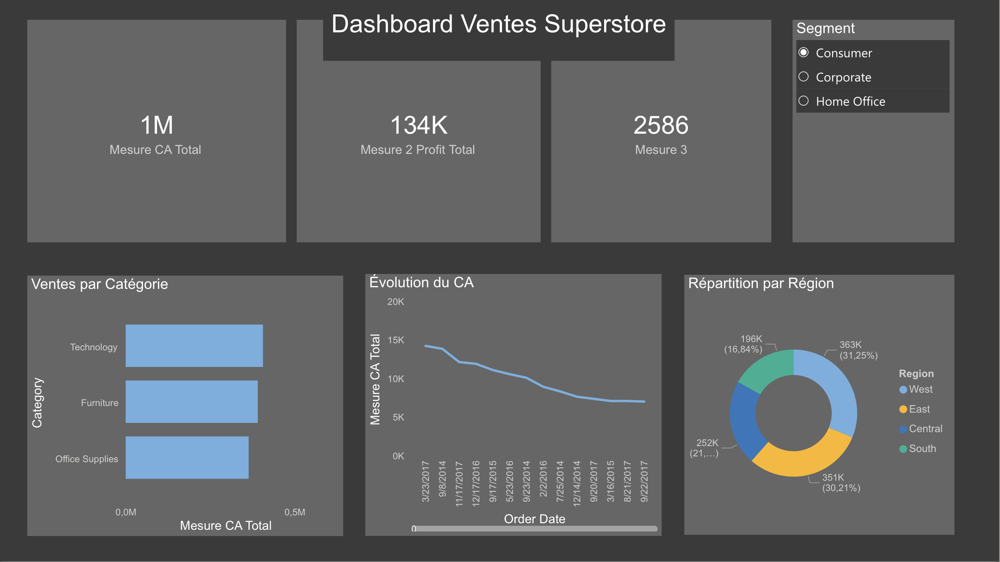

# Analyse de Performance Commerciale — Dashboard Superstore

## Contexte
Ce projet fait partie de mon portfolio Data Analyst. L'objectif est de transformer des données de ventes brutes en un outil de pilotage stratégique permettant de suivre la rentabilité par catégorie et par région via Power BI.

**Dataset :** Global Superstore (Kaggle) — +9 000 transactions, segments Consumer, Corporate et Home Office.

---

## Outils utilisés
- **Power BI Desktop** — Modélisation de données et visualisation
- **DAX (Data Analysis Expressions)** — Création de mesures calculées
- **Power Query** — Nettoyage et préparation des données

---

## Fichiers du projet
| Fichier | Description |
|---|---|
| `Superstore_Analysis.pbix` | Fichier source Power BI |
| `Sample - Superstore.csv` | Dataset brut utilisé pour l'analyse |
| `Dashboard_Ventes.png` | Screenshot du dashboard final |

---

## Analyses réalisées
1. **Pilotage de l'activité** — Suivi du CA (1M$), du Profit (134K$) et du nombre de commandes (2586)
2. **Performance par Catégorie** — Le segment "Technology" est le moteur principal du chiffre d'affaires
3. **Répartition Géographique** — La zone "West" domine le marché avec 31,25% des ventes
4. **Analyse de Segmentation** — Filtrage dynamique par profil client (Consumer, Corporate, Home Office)

---

## Dashboard final

---

## Auteur
**Jack Kadjo Touré** — Étudiant en Marketing Digital & Data Analysis (ISTEC Paris)  
[LinkedIn](https://www.linkedin.com/in/jack-kadjo-toure-b43450271/) | [Portfolio](https://ton-portfolio.netlify.app)
